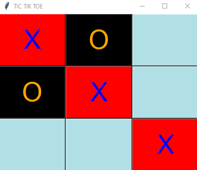
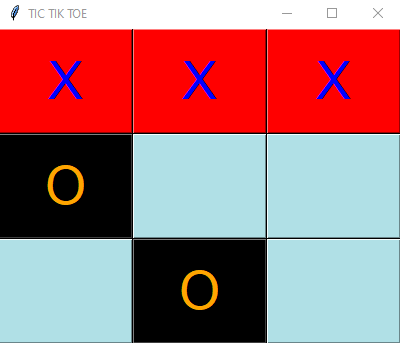
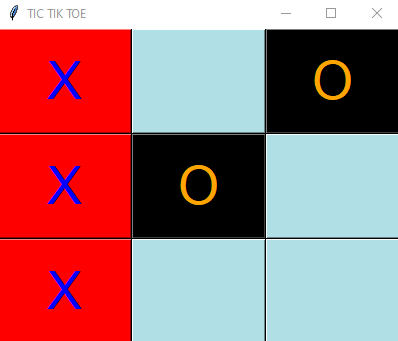

# Tic-Tik-Toe-Game
This is simple tic tik toe game developed using Python

## About Repository
This repository mainly contains the python code to develop tic tik toe game.  
It uses [tkinter](https://docs.python.org/3/library/tkinter.html) package which is the standard Python interface to the Tk GUI toolkit.

## Snippets
 

  
  

  
  
 

  
  

  
  
  
 
 

  
  

 
## About Me 
 
 Omkar Atugade, 
 Mumbai, Maharashtra, India.
 
## Follow Me On
 
  [Instagram](https://www.instagram.com/omi_atugade) 
  [Facebook](https://www.facebook.com/Omkar-Atugade) 
  [Twitter](https://www.twitter.com/Atugade-Omkar)

